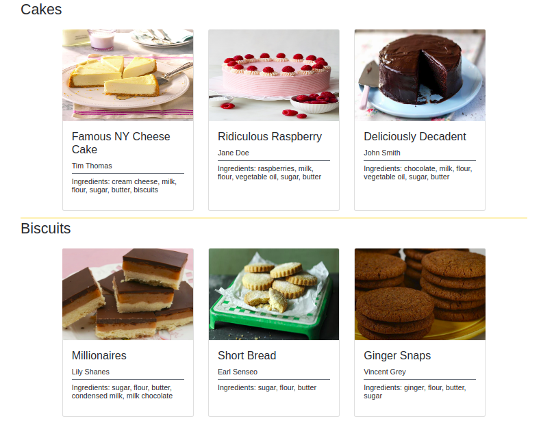

# Backschachtel

Befülle eine Website mit Details zu Rezepten!

**Anleitung**:
* In der Datei `scripts/data.js` findest du eine Datenstruktur für die Details der Rezepte.
* Exportiere die Datenstruktur als JSON-String.
* Importiere den JSON-String, wandle ihn in ein Array von Objekten um und weise es einer Variablen mit dem Namen [parsedData] in der Datei `scripts/index.js` zu.
* Erstelle in der Datei `scripts/index.js` ein Programm, das die [parsedData] auf der Website einfügt. Die Seite sollte jedes Rezept als Karte anzeigen, die das Rezeptbild, den Titel, den Autor und die Zutaten enthält.
* Achte darauf, dass jedes Rezept in den **richtigen** Bereich eingefügt wird, d.h. Kuchenrezepte sollten in den Bereich "cakes" usw. eingefügt werden.
* Hinweis: Schwierigkeiten beim Einstieg? Nimm dir die Zeit, die Meldungen zu lesen, die in deinem Terminal ausgegeben werden.
* Hinweis: Hast du immer noch Probleme beim Starten? Frag nach Hilfe :)

